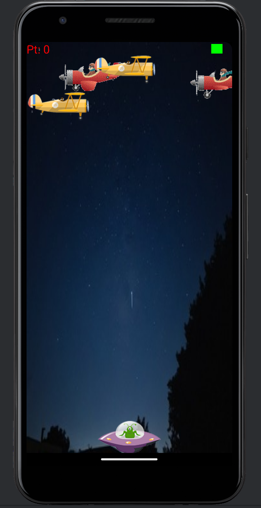

# Plane Shooting



## Description

Plane Shooting is an engaging and exciting game where players navigate through different levels, shooting down enemy planes and avoiding obstacles.

## Features

- Multiple levels with increasing difficulty
- Different types of enemy planes
- Power-ups and upgrades
- High score tracking
- Responsive design

## Installation

1. Clone the repository:
    ```sh
    git clone https://github.com/YOUR_GITHUB_USERNAME/YOUR_REPOSITORY_NAME.git
    ```
2. Navigate to the project directory:
    ```sh
    cd YOUR_REPOSITORY_NAME
    ```
3. Install dependencies:
    ```sh
    npm install
    ```
4. Start the application:
    ```sh
    npm start
    ```

## Usage

Use the arrow keys to navigate your plane and the space bar to shoot. Avoid enemy planes and obstacles, and collect power-ups to enhance your abilities.

## Contributing

Contributions are welcome! Please fork the repository and create a pull request with your changes.

## License

This project is licensed under the MIT License.

## Contact

For any inquiries, please contact [YOUR_NAME] at [YOUR_EMAIL].
